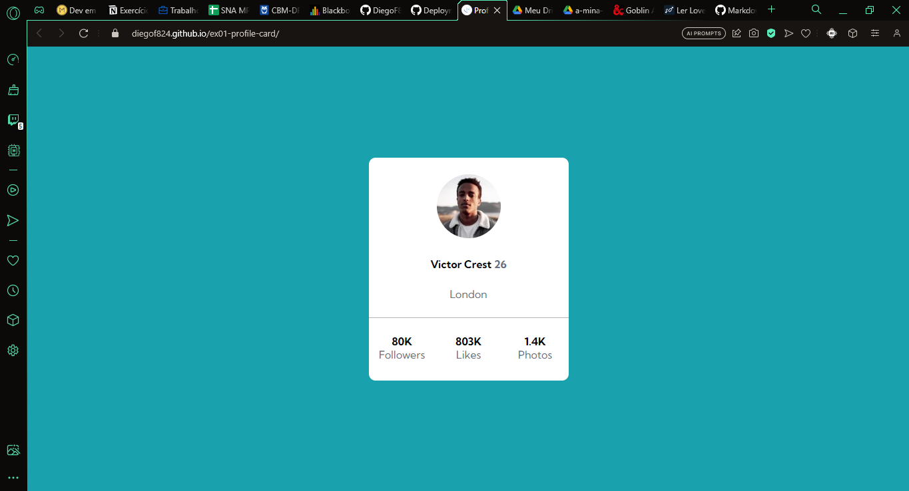
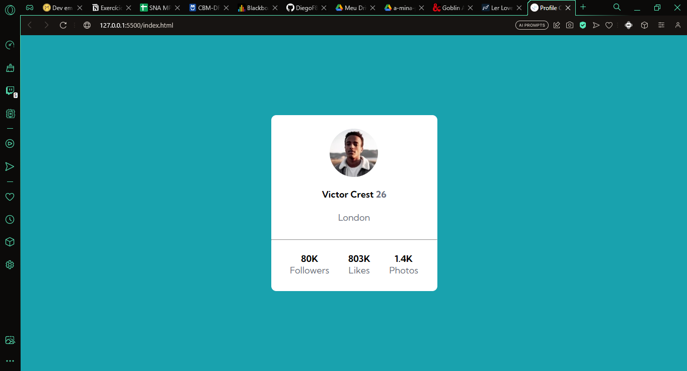

# Exercício 01 - HTML e CSS Avançado Flexbox - Profile Card
O exercício tem como objetivo criar um cartão de perfil utilizando o _flexbox_ do CSS e HTML.

## HTML
Primeiro eu desenvolvi todo a estrutura HTML da página.
Eu criei um conteiner usando a tag **_section_** e a tag **_div_** para criar os itens do container.

### Resolução
Após concluir a atividade, fiz a correção com a resolução.
Na página, eu criei o container usando a tag **_section_** e uma tag **_div_** para ser o container. Na resolução, o container é um elemento **_main_** com um elemento **_div_** filho para ser o cartão.
Na primeira página, a imagem de perfil foi inserida dentro de uma div enquanto as demais informações do perfil estavam na _div container_. Na resolução, a imagem de perfil foi inserida numa div junto com as informações de nome, idade e cidade.
A divisão entre as informações do perfil e os números foram separados inserindo um _border_ na div que continha os números do perfil, na primeira página. Na segunda página, a divisão foi criada inserindo um elemento **_hr_**
Na primeira página, os números de followers, likes e photos foram criados com a tag **_p_**. Na resolução esses números forma criados com o uso de uma lista desordenada, **_ul_**.

## CSS
Para o css, eu crei dois arquivos: style.css e o reset.css. No reset.css, eu removi o padding e o margin padrão de todos os elementos e padronizei o padding-top e text-align de todos os elementos com a classe item. No style.css, construi toda a estilização da página e o posicionamento do profile card e seus itens com flexbox.

### Resolução
Na resolução do exercício as cores do background e de certos trexos do texto forma inseridas através do uso de variáveis, enquanto na primeira página, as cores foram inseridas diretamente nas propriedades do CSS.
Outra diferença da primeira página é que a fonte foi inserida através do _import_ no arquivo CSS. Na primeira página, a fonte foi inserida com a tag **_link_** no HTML.

# Resultado
## Inicial - primeira página

## Final - resolução
